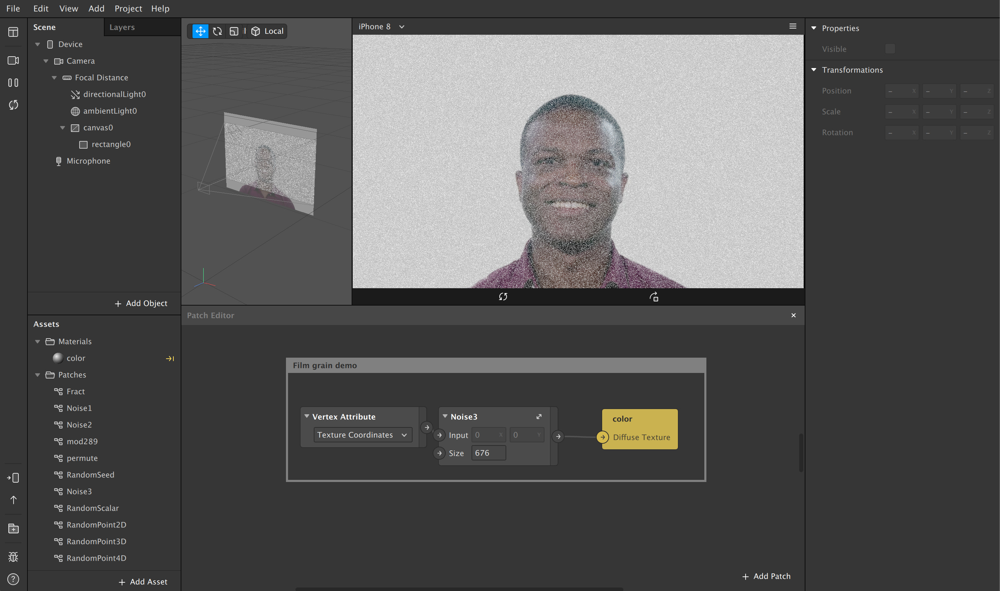

# spark-noise-patches
Various noise patches for Spark AR.

Note that the noise patches DO NOT actually work on device. Your best bet for making film grain would be to use a grain texture, or a series of grain textures in an animation.

https://photo.stackexchange.com/questions/1011/what-is-the-difference-between-digital-high-iso-noise-and-film-grain

### Donations

If you used this in client projects, or simply enjoyed making effects with my open-source projects, please consider a donation or sponsorship. One-time donations can be made with PayPal. Subscriptions can be through PayPal or Github Sponsors (click the heart sponsor button at the top of the page).

